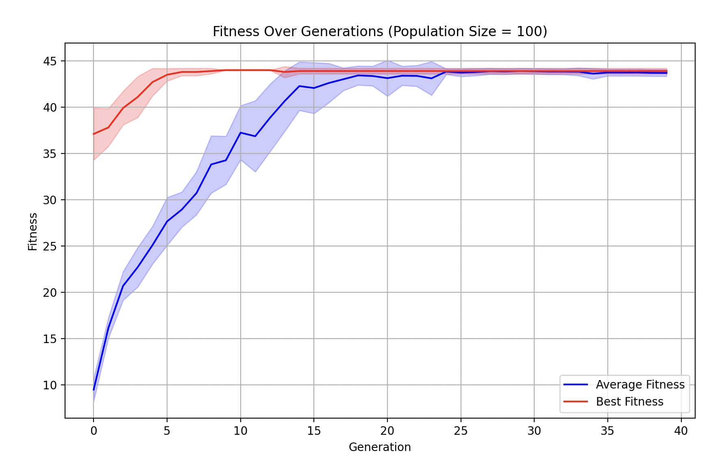
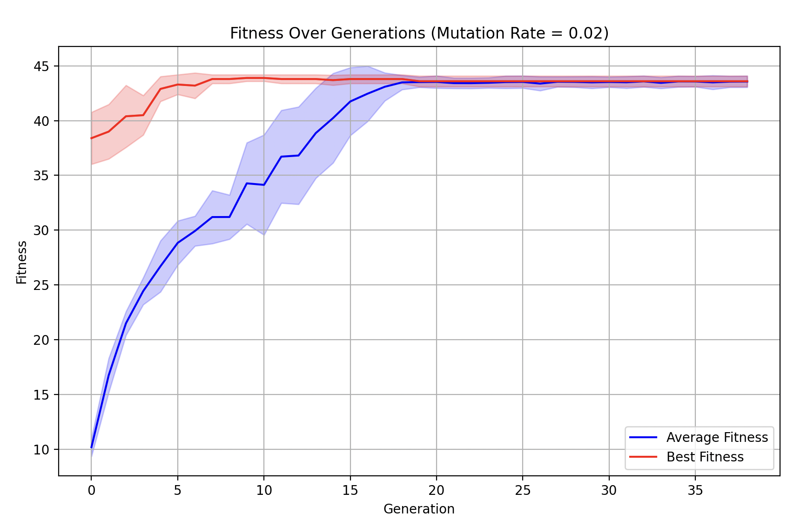
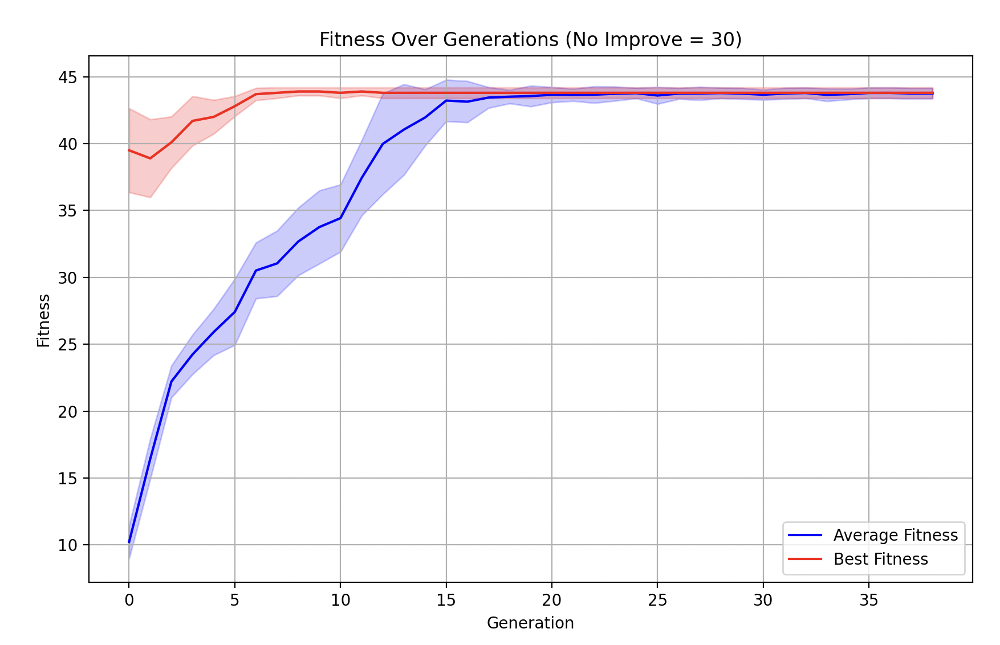

# Genetic Algorithm for the Knapsack Problem

## Introduction

This program implements a genetic algorithm to solve the knapsack problem. Imagine you are going on a hiking trip and need to pack a backpack with items that maximize importance while staying under a weight limit (250). Each item has a weight and importance value, and you must choose which items to include to optimize the total importance while ensuring the total weight doesn't exceed the limit. The program uses a genetic algorithm to test solutions and find an optimal (or close to optimal) packing solution.

## Dependencies / Assumptions

Dependencies:
- Python 3
- NumPy
- Matplotlib

Assumptions:
- No duplicate items allowed
- All weights and importance values are positive integers
- Backpack has a fixed weight capacity of 250
- All 12 boxes are uniquely identifiable and have fixed weights and importances
- Culling of 50% at every generation
- (Hyperparameter choices explained lower down)

## How to Run

1) Ensure all dependencies are installed: 'pip3 install numpy matplotlib'
2) Navigate to the directory containing ga.py: 'cd /path/to/directory'
3) Run the program: 'python3 ga.py'
4) View the results: best solution found and fitness plot

## Code Structure

Main functions/components of code:
- calculate_fitness(): calculates fitness of a solution
- generate_random_chromosome(): creates initial random solutions
- select_population(): implements truncation selection (using 50% culling)
- crossover(): does 2-point crossover
- mutate(): mutates via bit-flip
- genetic_algorithm(): main algorithm loop
- run_multiple_ga(): runs the algorithm multiple times
- plot_multiple_runs(): fitness function for multiple runs over generations
- plot_single_run(): fitness function for a single run over generations
- print_intro(): prints algorithm introduction, parameters, details, etc.
- get_user_confirmation(): handles user confirmation
- get_run_type(): assists UI in getting run type from user (single vs. multiple runs)
- get_number_of_runs(): assists UI with determining number of runs from user input
- print_solution(): prints final results

## Outline of the Problem as a Genetic Algorithm

The knapsack problem is implemented as a genetic algorithm by representing potential solutions as binary strings and shifting them over generations to find the best (optimal for weight and importance) packed bag:

### Genome for the Problem
- Binary string representation (length 12)
- Each position represents one box (1 = included, 0 = excluded)
- Example: [1,0,1,0,0,1,0,0,0,1,0,0] represents including boxes 1,3,6,10

### Fitness Function
- Calculates total importance if weight constraint is met (returns 0 if overweight)
- Maximizes importance while enforcing weight constraint

### Selection Mechanism
- Truncation rank-based selection chosen as mechanism
- Selects top 50% of population each generation

### Crossover Operation
- 2-point crossover (12-bit is long enough that 1-point seemed less robust): randomly selects two points in parent chromosomes and creates children by swapping segments between these points

### Mutation Operation
- Bit-flip (0 to 1 or vice versa) mutation; mutates with mutation_rate of 2% (0.02)
- Each bit in the chrommosome has a small chance to flip, which helps maintain diversity

### Fitness Graphing
- Plots average and best fitness over generations, shows convergence patterns, helps visualize algorithm in action

## Hyperparameter Tuning

I determined optimal hyperparameters (population size, mutation rate, generations without improvement) via rigorous testing, and looking at fitness graphs across numerous model runs for varied parameters (the others held constant):

### Population Size

I tested population sizes: 50, 75, 100, 125, 150, 200, and 500. A population size of 100 seemed to show an optimal balance between exploration and convergence.

### Mutation Rate

I tested mutation rates: 0.01, 0.02, 0.05, and 0.1. A mutation rate of 0.02 was found as optimal, since it seemed to converge more smoothly and balance exploration vs exploitation. 

### Generations without Improvement

I tested generations of: 20, 25, 30, 40, 50, 100, 200, and an adaptive one (depending on max generations). 30 provided sufficient time for convergence without premature termination, and avoided the algorithm running for an unnecessarily long amount of time. This hyperparameter works to terminate the algorithm before the maximum number of generations once it has found a solution. 

## User Interface

My program includes a brief interactive command line interface that helps walk users through running the algorithm. Upon running (with 'python3 ga.py'), users are shown the possible boxes, their properties, and current hyperparameters of the algorithm with brief justifications for why they were set at those values. Users can then choose between running the algorithm once or multiple times: if multiple times, they can choose a standard 10 runs or specify their own desired number of runs between 1 and 100. Afterwards, the program will present the user with the best results, and a fitness graph that shows the algorithm's convergence over generations (which, if multiple runs are chosen, will also have std. dev. shown). 

## Notes

- Algorithm seems to consistently find solutions with fitness values around 43/44; this performance is stable across multiple runs. 
- Hyperparameters and available items are explained in the UI when the code is run